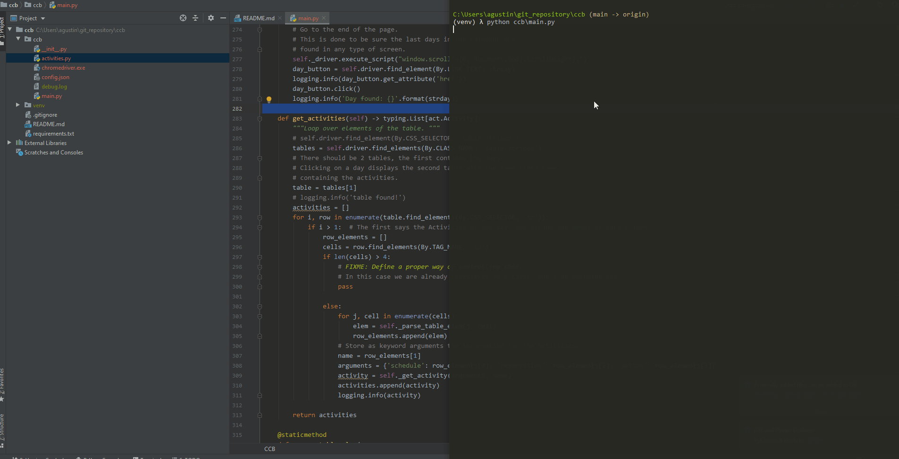

# CCB
In the wake of the infamous pandemic, the spots to train at my crossfit box are getting
harder to find, due to the decrease in places. Knowing this, other people reserve
its places in the app in advance, even though they finally don't attend the class.

To avoid constantly checking the app for a place, I came up with a simple 
script that enters to the web page of the box, gets registered, and checks 
the classes you would like to attend have a free spot. In case a free spot is
found, gets you registered and gets closed.

The work under the hood is done with [selenium](https://selenium-python.readthedocs.io/).

### What it does

The script runs opens the browser in *headless* mode in chrome (without opening the
browser), but if the headless option wasn't given, we would see the browser doing the following 
sequence (but much slower):




### How it works

Fill the **Username** and **Password** in the [config.json](config.json),
and the classes to attend following the structure:

```
"days": {
    "dd/mm/yyyy": {
        "hh:mm": [CLASS]
    }
}
```

Where _CLASS_ must be one of *Open Box*, *Crossfit*, *Calsithenics* or *Weightlifting*
(basically the ones offered right now). More than one day can be added, just like
hours to attend, or classes to the list.

Internally loops over the classes and the hours to see if any meets the requirements
and if thats the case, runs for a given time (TO BE DEFINED) and gets closed if every
class could be registered.

From a proper `venv` with the requirements installed, 
just run the script from the console on top of the package: `python ccb\main.py`, and wait
for the logs to appear in your console.


